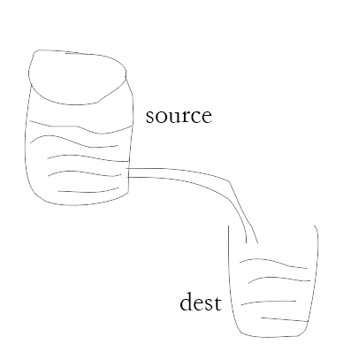

# Node.js Stream(流)

Stream是一个抽象接口, Node中有很对对象实现了这个接口. 例如, 对http服务器发起请求的request对象就是一个Stream, 还有stdout(标准输出).

Node.js, Stream有四种流类型:
- Readable  可读操作
- Writeable 可写操作
- Duplx 可读写操作
- Transform 操作被写入数据,然后读出结果

所有的Stream对象都是EventEmitter的实例. 常用的事件有:

- data  当有数据可读时触发
- end 没有更多的数据可读时触发
- error 在接收和写入过程中发生错误时触发
- finish  所有数据已被写入到底层系统时触发

---

## 从流中读取数据

创建input.txt文件. 内容如下:

```
Node.js 学习笔记: https://www.cnblogs.com/dfyg-xiaoxiao/
```

创建main.js文件. 代码如下:

```js
var fs = require('fs')
var data = ''

// create readable stream
var readerStream = fs.createReadStream('input.txt')

// set encoding as utf8
readerStream.setEncoding('UTF8')

// handle stream event -> data, end and error
readerStream.on('data', function(chunk){
  data += chunk
})

readerStream.on('end', function(){
  console.log(data)
})

readerStream.on('error', function(err) {
  console.log(err.stack)
})

console.log('code run end!')
```

执行结果

```
code run end!
Node.js 学习笔记: https://www.cnblogs.com/dfyg-xiaoxiao/
```

## 写入流

创建main.js文件:

```js
// main.js
var fs = require('fs')
var data = 'node.js 学习' + +new Date()

// create a writeable stream and set data in the file
// create file if not exist
var writeStream = fs.createWrtieStream('output.txt')

// set data encoding
writeStream.setEncoding(data, 'UTF8')

// make file end
writeStream.end()

// handle stream event -> end, finish, error
writeStream.on('finish', function(){
  console.log('write finish')
})

writeStream.on('end', function() {
  console.log('write end')
})

writeStream.on('error', function(err) {
  console.log(err.stack)
})

console.log('run end!')
```

执行结果:

```
run end!
write finish
```

## 管道流

管道流提供了一个输出流到输入流的机制. 通常我们用于从一个流中获取数据并将数据传递到另一个流中.



如上图, 把文件比作装水的桶, 而水就是文件里的内容. 用一个管子(pipe)链接两个桶使得水从一个桶流入另一个桶. 这样慢慢的实现了大文件的复制过程.

下例中我们读取一个文件内容并将内容写入到另一个文件中.

input.txt
```
管道流操作  nodejs pipe stream
管道流.....
```

main.js
```js
var fs = require('fs')

// create a readable stream
var readStream = fs.createReadStram('input.txt')

// create a writeable stream
var writeStream = fs.createWriteStream('output.txt')

// pipe opaction
// read input.txt content and write into output.txt
readStream.pipe(writeStream);

console.log('code run end!')
```

## 链式流

链式流式通过连接输出流到另外一个流并创建多个流操作链的机制. 链式流一般用于管道操作.

接下来就是管道和链式来压缩和解压文件.

创建compress.js文件.

```js
var fs = require('fs')
var zlib = require('zlib');

// 压缩input.txt 文件为input.txt.gz
fs.createStream('input.txt')
  .pipe(zlib.createGzip)
  .pipe(fs.createWriteStream('input.txt.gz'))

console.log('zlib end')
```

创建解压程序 decompress.js

```js
// decompress.js

var fs = require('fs')
var zlib = require('zlib')

fs.createReadStream('input.txt.gz')
  .pipe(zlib.createGunzip())
  .pipe(fs.createWriteStream('input.gz.txt'))

console.log('decompress end!')
```